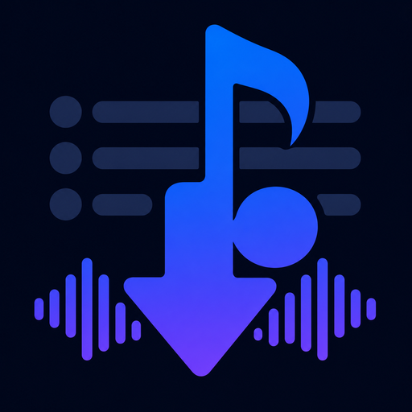

# Playlist DL



Windows personal-use playlist downloader. Paste a Spotify playlist, album, or track URL, inspect and select tracks, download source audio through spotDL/yt-dlp, convert to your chosen format, and retain playlist metadata.

> [!WARNING]
> This project is unofficial and not affiliated with Spotify, YouTube, Google, or spotDL. Platform terms can prohibit automated retrieval and audio extraction even for personal use. Users must determine whether each download is permitted where they live and by relevant service terms. No rights to hosted media are granted by this software.

## Current development setup

Requirements: Windows 10 22H2+ x64, .NET 10 SDK, uv, FFmpeg, Deno.

```powershell
uv sync --project backend --extra dev
uv run --project backend --extra dev ruff check backend
uv run --project backend --extra dev ruff format --check backend
uv run --project backend --extra dev python -m pytest
dotnet build PlaylistDl.slnx
dotnet run --project src/PlaylistDl.App/PlaylistDl.App.csproj
```

UI launches backend through `uv` during development. Set `PLAYLISTDL_BACKEND_PATH` to a frozen backend executable to override this.

## Features

- Spotify public playlist, album, and single-track resolution through spotDL experimental resolver
- Free-text search intake: type artist and title, pick from ranked YouTube Music songs — works even without Spotify
- CSV and JSON track-manifest import, including common Exportify columns
- YouTube Music/YouTube matching with duration-checked multi-query alternate-source recovery
- Per-track manual YouTube source override for correcting a weak or wrong automatic match
- Per-track selection with select-all and live filtering by title, artist, or album
- Per-track and overall progress, bounded parallel downloads, measured throughput/ETA, duplicate scanning, batch cancellation
- Multi-source download queue with per-job settings snapshots and sequential execution
- Per-track Done/Failed results with selectable exact errors, retained session logs, one-click retry, and automatic backoff retry for transient failures
- Failure banner with actionable guidance plus built-in network diagnosis that reveals antivirus/firewall per-app blocks
- Optional download pacing and advanced yt-dlp argument passthrough
- Job library with restart-safe resume, per-source progress history, and one-click playlist Sync that downloads only new or unfinished tracks
- Output formats: MP3 (V0 default, 320 kbps option), M4A, Opus, FLAC, OGG, WAV; Windows-compatible tags, cover art, and optional embedded lyrics
- Configurable source folders and filename layouts, including album/track folder organization and automatic collision-safe suffixes
- Optional .m3u8 playlist export preserving track order, plus Open folder shortcut
- Optional YouTube cookie file for authenticated/Premium formats
- Update awareness: silent daily startup check plus on-demand check against published GitHub releases
- One downloadable self-contained Windows x64 executable

Session logs live under `%LOCALAPPDATA%\PlaylistDL\logs` and can be opened from **Run log**. Logs retain exact provider failures for 14 days; cookie contents and application secrets are never written by Playlist DL.

### Track manifest format

Use **Import CSV/JSON** when Spotify resolution is unavailable or when metadata comes from another source. Every row requires a title and artist. Supported common fields include album, duration, Spotify URL/URI, ISRC, cover URL, year, release date, and track number.

Minimal CSV:

```csv
title,artist,album,duration_seconds
Song One,Artist One,Album One,185
```

Minimal JSON:

```json
{
  "name": "My tracks",
  "tracks": [
    { "title": "Song One", "artist": "Artist One", "album": "Album One", "duration_seconds": 185 }
  ]
}
```

## Known limitations

- Public Spotify resolution uses experimental unofficial SpotAPI/spotipyFree path and may break after platform changes.
- Spotify is used only during source resolution; downloads use retained metadata and do not require a second Spotify session.
- Cancellation takes effect after currently active download batch finishes.
- Public matching cannot recover audio absent from available providers. Duration-checked alternates are tried automatically after recoverable failures; use the per-track Source dialog when no safe match exists.
- The candidate search and update check need direct network access; strict per-app firewalls can block them (use the in-app Diagnose button).
- If security software blocks the extracted backend path, Settings can select an allowed `playlistdl-backend.exe`; outdated saved overrides are rejected and replaced by the current bundled backend before a job starts.
- Release executable is unsigned and can trigger Windows SmartScreen unknown-publisher warning.

## Release build

```powershell
./scripts/build-release.ps1 -Version 2.0.0
./scripts/verify-release.ps1
./scripts/smoke-backend-lifecycle.ps1
./scripts/smoke-frozen-backend.ps1
```

Build freezes Python backend, excludes unused HTTP-server modules, bundles local `ffmpeg`, `ffprobe`, and `deno`, verifies helper hashes at runtime, then publishes `artifacts/release/PlaylistDL.exe`. Released executable extracts versioned helpers under `%LOCALAPPDATA%\PlaylistDL\tools` on first use. Release directory also contains checksummed license and third-party notices.

See [ROADMAP.md](ROADMAP.md) for current development priorities and standing release gates.

## License

GPL-3.0. See [third-party notices](THIRD_PARTY_NOTICES.md) and [privacy policy](PRIVACY.md).
